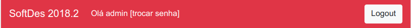

# Alunos

## Como acessar o servidor
Para acessar a plataforma de desafios de programação, o aluno deve primeiramente fazer login. O *username* é o mesmo do 
Blackboard e a senha é igual o usuário. (`username`: igord, `password`: igord)

## Alterar senha
Como a senha é fraca, o usuário deve logo em seguida do seu primeiro acesso, alterar a senha. Isso pode ser feito por
meio do link *[trocar senha]* do canto superior esquerdo da página.

## Saindo da plataforma
Para se desautenticar da plataforma (logout), o usuário pode clicar no botão no canto superior direito do site.

## Como enviar as soluções
Para enviar soluções do desafio, o usuário deve clicar no botão *Escolher arquivo* e carregar UM arquivo `.py` da sua
resposta.

A solução será analisada e o resultado ficará apresentado da seguinte maneira:

##### Resposta correta

##### Resposta com erros

