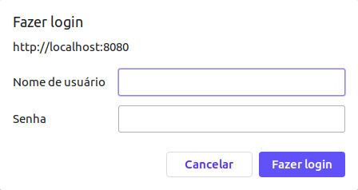

# Guia do Desnvolvedor

## Configurando o Ambiente
O primeiro passo para utilizar o servidor é configurar o ambiente. Antes de tudo é necessário criar o banco de dados(BD) onde será armazenado tanto as perguntas dos desafios como os usuários da ferramenta, ou seja, os alunos.

Para tanto é necessário instalar o gerenciador do BD, sqlite3. Execute o comando abaixo em um novo terminal (Crtl+Shift+T) para instalar o sqlite3.

```$ pip install pysqlite3```

Com o gerenciador instalado o próximo passo é criar o banco de dados utilizando o sqlite3. O comando abaixo permite criar um BD com o nome "quiz", este comando deve ser executado na pasta `src/` do projeto. 

```$ sqlite3 quiz.db```

Ao Executar o comando um documento chamado `quiz.db` será criado na mesma pasta e o seu terminal deverá estardentro do ambiente do sqlite3.
Para checar se o banco de dados foi devidamente criado, execute o seguinte comando no sqlite3.

``` sqlite> .database```

A função deve retornar o caminho até o documento `quiz.db`. Com isso feito, agora é necessário criar as tabelas do projeto. Assim, deve-se executar o seguinte comando:

``` sqlite> .read quiz.sql```


Ou simplesmente execute o comando abaixo, assim irá criar o banco de dados e redirecionar as tabelas para o mesmo.

```$ sqlite3 quiz.db < quiz.sql```

Para checar se as tabelas foram de fato criadas execute o seguinte comando:

```sqlite> .tables ```

O retorno será as tabelas do projeto. Neste caso:
```QUIZ      USER      USERQUIZ```

## Como executar o programa

Com o banco de dados já configurado, o próximo passo é executar o programa. Primeiramente é necessário criar um login de administrador, para isso basta olhar o item "Adiciona Usuário" do arquivo [professor](professor.md).

Para abrir o programa, basta executar o arquivo python `servidor.py`.

```$ python servidor.py```

O programa estará rodando no localhost na porta 8080. Assim, para ver o conteúdo da página é necessário abrir um navegador e acessar o seguinte link: `http://0.0.0.0:8080/`.

Ao entrar na página irá aparecer um *popup* onde é possível inserir suas informações para login e assim acessar o servidor de desafios.


## Como contribuir

Para realizar contribuições no projeto:

- Faça um Fork do projeto
- Crie uma Branch para sua Feature (`git checkout -b feature/<nome_feature>`)
- Adicione suas mudanças (`git add .`)
- Comite suas mudanças (`git commit -m 'Adicionando feature`)
- Faça o Push da Branch (`git push origin feature/<nome_feature>`)
- Abra um Pull Request no Github 