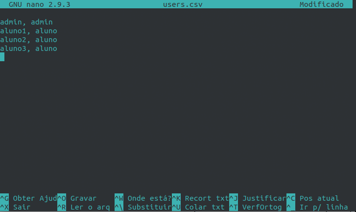
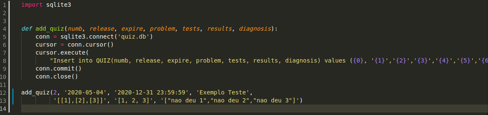

# Professores

## Adicionando os Usuários (Alunos)

O primeiro passo é criar um documento `.csv`, na pasta `src/` do projeto. O comando abaixo irá criar o documento e abrir para a edição no editor *nano*.

```$ nano users.csv```

Para adicionar os usuários é necessário escrever o login e o seu tipo sepados por vírgulas, sendo que este último pode ser `admin` para administrador ou `aluno` para os alunos. Cada linha recebe a informação de um usuário. Adicione primeiramenta na primeira linha o administrador da página (admin, admin) e em seguida os alunos.



Para salvar o arquivo basta utilizar o comando Gravar (Ctrl+O) e então fechar o arquivo (Ctrl+X). A senha poderá ser alterada posteriormente pelo aluno.

Com o arquivo editado o próximo passo é adicionar esses novos valores a tabela, ou seja, popular a tabela `USER`. Para isso basta executar o arquivo python `add_user.py`.

```$ python add_user.py```

Não é necessário passar o arquivo como argumento, apenas é estritamente necessário criar o arquivo com o nome `users.csv`. Agora o projeto já possui os seus usuários!

## Adicionando Novos Desafios

Para adicionar novos desafios é um pouco mais complicado. Os novos desafios são inseridos no próprio arquivo python `add_quiz.py`. Na última linha do documento basta inserir uma linha de chamada de função que segue o seguinte modelo:

`add_quiz(numb, release, expire, problem, tests, results, diagnosis)`

A cada linha será inserido as informações de cada desafio. A estrutura para adiconar um novo desafio é (numb, release, expire, problem, tests, results, diagnosis), sendo os seus significados:

- **numb**: Numeração do desafio
- **release**: Data de lançamento
- **expire**: Data de validade
- **problem**: Descrição do desafio
- **test**: Possíveis entradas da função
- **result**: Resultados das entradas fornecidas pelo **test**
- **diagnosis**: Mensagem de erro específica para cada entrada



O seu arquivo deve ficar semelhante com a imagem acima. onde a útima linha do documento é a chamada de função com os argumentos do novo desafio.

`add_quiz(2, '2020-05-04', '2020-12-31 23:59:59', 'Exemplo Teste', '[[1],[2],[3]]', '[1, 2, 3]', '["nao deu 1","nao deu 2","nao deu 3"]')`

Para enviar os teste para o servidor basta executar o arquivo python `add_quiz.py`.

```$ python add_quiz.py```

Agora o projeto já possui os desafios!